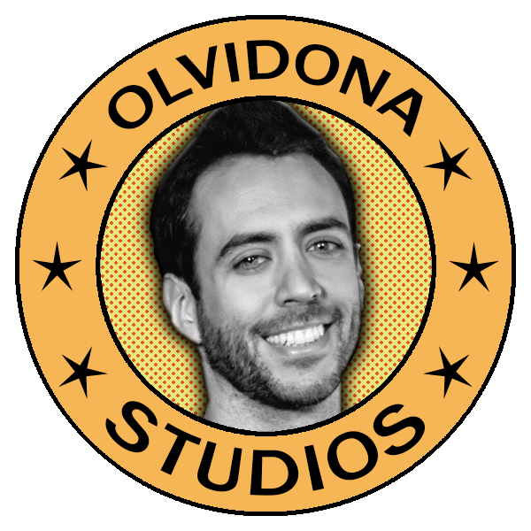

<p align="center>
  
</p>

## Our Project
We’re going to replicate the 899 Tetris game arcade version developed by Alexey Pajitnov and published by Atari as a tribute to the game. This project has been done by four catalan students of CITM - UPC (Terrasa, Spain).

## About the game
Tetris is a puzzle and strategy video game with genres that are closely related to each other since it is in puzzles that you have to fit pieces but applying strategy to achieve it in the most optimal way possible, this applies perfectly to Tetris where you have to move the pieces towards the sides and rotate them to fit each other and thus eliminate rows to survive.
There are three base levels made up of three rounds each when you pass these rounds you go to the next level

## Gameplay
```markdown

(Aqui va el video)

```
## Controls

```markdown

(Aqui van los controles)

```

## Olvidona Studios - Our Team

<p>
  
</p>
                                             
## Members

**Javier Valencia**

* Design
* Github: [JaviVP](https://github.com/JaviVP)

**Biel Rubio**

* Art
* Github: [BielRubio](https://github.com/BielRubio)

**Sergi Rubio**

* Code
* Github: [SergiRubio156](https://github.com/SergiRubio156)

**Nacho Moreno**

* Management/Q&A
* Github: [NachoMoren](https://github.com/NachoMoren)

**Maksym Polupan**

* Code
* Github: [Maksym203](https://github.com/Maksym203)
